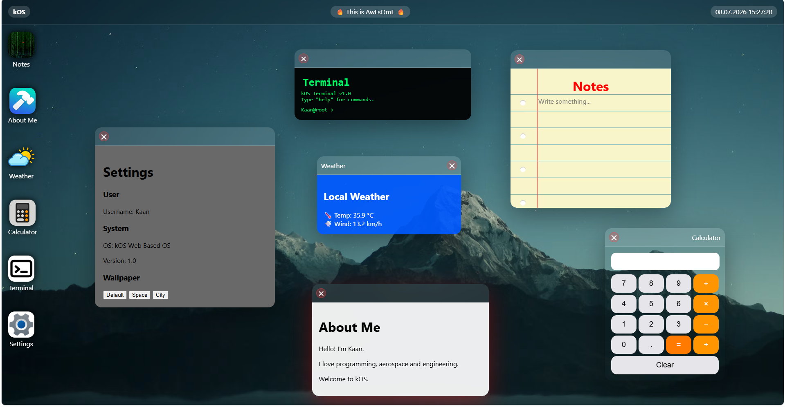
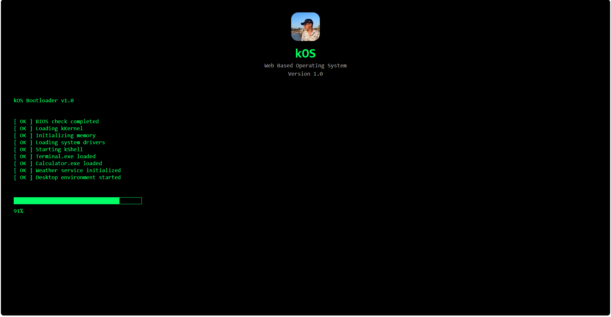
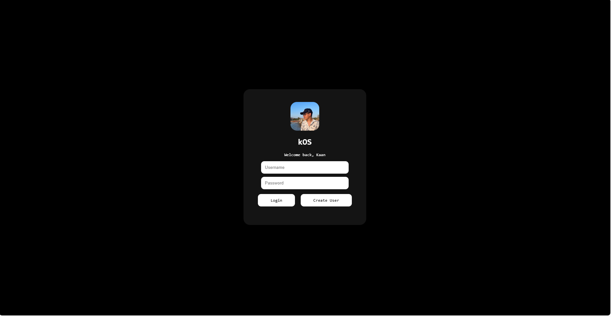

# kOS
The best OS u will see in your entire life

---

## Features

-  Modern desktop interface
-  Draggable and movable windows
-  Settings application
-  Live clock
-  Taskbar
-  Calculator
-  Terminal
-  Boot Screen
-  Login Screen

---

## Built With

- HTML5
- CSS3
- JavaScript

## DA BOOT SCREEN
bip boop

## LOGIN
log in log out log in log out

## Apps
1. a notes app
* u can write anything in this app
* plus it looks like a real notebook!
2. about me app
* sum info about me!
3. weather app
* you can see the weather of my hometown!
* it shows live data with the help of OpenMeteo
4. calculator
* MATH
* I LOVE MATH
5. terminal
* IM A HACKER
6. Settings
* u can change ur wallpapar here!

## AI Usage

AI-assisted tasks included:

* DevLog
* TroubleShooting
* Documentation Support

All architecture decisions, implementation, integration, testing, and final development work were completed by the developer.

## Developer

Created by ME!

Student • Programmer • Aerospace & Engineering Enthusiast

If you enjoy the project, consider giving it a ⭐ on GitHub.

