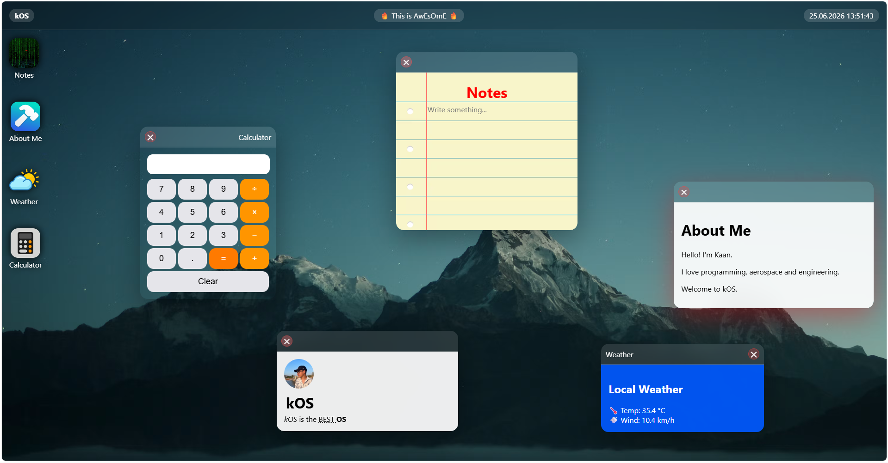

> the best OS u will se in ur entire life!

##  About

kOS is a desktop-inspired operating system experience that runs entirely in the browser.

The project recreates key operating system concepts such as windows, applications, desktop interactions, widgets, and system utilities while remaining lightweight and easy to deploy.

Designed and developed as a front-end engineering project, kOS focuses on simplicity, responsiveness, and a clean user experience.

---
## Features
1. a notes app
* u can write anything in this app
* + it looks like a real notebook!
2. about me app
* sum info about me!
3. weather app
* you can see the weather of my hometown!
* it shows live data with the help of OpenMeteo
4. calculator
* MATH
* I LOVE MATH

## Languages Used

* HTML5
* CSS3
* Vanilla JavaScript

## AI Usage

AI-assisted tasks included:

* DevLog
* TroubleShooting
* Documentation Support

All architecture decisions, implementation, integration, testing, and final development work were completed by the developer.

## Developer

Created by ME!

Student • Programmer • Aerospace & Engineering Enthusiast

If you enjoy the project, consider giving it a ⭐ on GitHub.

### 🚀 kOS — A Desktop Experience Inside Your Browser.

