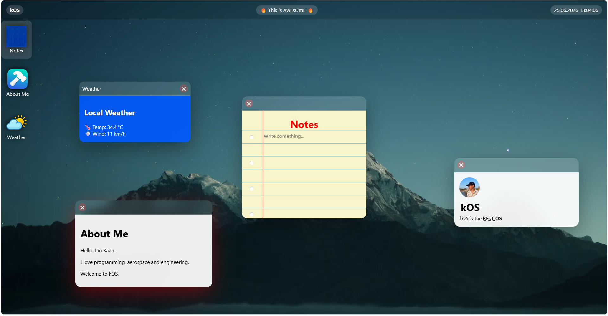

# 🖥️ kOS

> A lightweight browser-based operating system built with pure HTML, CSS, and JavaScript.

## ✨ About

kOS is a desktop-inspired operating system experience that runs entirely in the browser.

The project recreates key operating system concepts such as windows, applications, desktop interactions, widgets, and system utilities while remaining lightweight and easy to deploy.

Designed and developed as a front-end engineering project, kOS focuses on simplicity, responsiveness, and a clean user experience.

---

## 🚀 Features

### 🖥️ Desktop Environment

* Modern desktop interface
* Custom wallpaper support
* Responsive layout
* Clean and minimal design

### 🪟 Window System

* Open and close applications
* Draggable windows
* Independent application instances
* Smooth desktop workflow

### 📝 Notes Application

* Built-in note-taking application
* Simple writing experience
* Desktop-integrated interface

### 🌦️ Weather Application

* Displays local weather information
* Temperature display
* Wind speed display
* Lightweight weather widget

### 👤 About Me Application

* Personal profile window
* Introduction section
* Desktop card interface

### 📌 System Bar

* Live clock and date
* System status area
* Modern operating-system-inspired navigation

### 🎨 User Interface

* Rounded design language
* Blur and transparency effects
* Smooth interactions
* Lightweight architecture

---

## 🛠️ Technologies Used

* HTML5
* CSS3
* Vanilla JavaScript

No frameworks were used.

---

## 🤖 AI Usage

Artificial Intelligence was used as a development assistant during the creation of kOS.

AI-assisted tasks included:

* DevLog
* TroubleShooting
* Documentation Support
* README

All architecture decisions, implementation, integration, testing, and final development work were completed by the developer.

---

---

## 🎯 Project Goal

The goal of kOS is to explore how operating system concepts can be recreated using only web technologies while improving front-end development, software design, and problem-solving skills.

---

## 👨‍💻 Developer

Created by **Kaan**

Student • Programmer • Aerospace & Engineering Enthusiast

If you enjoy the project, consider giving it a ⭐ on GitHub.

---

### 🚀 kOS — A Desktop Experience Inside Your Browser.

